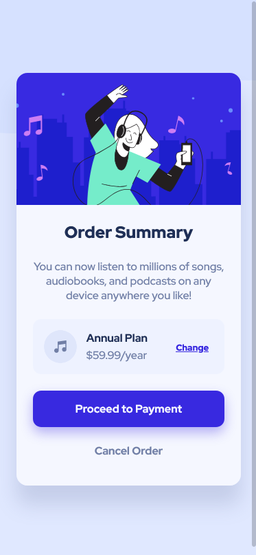
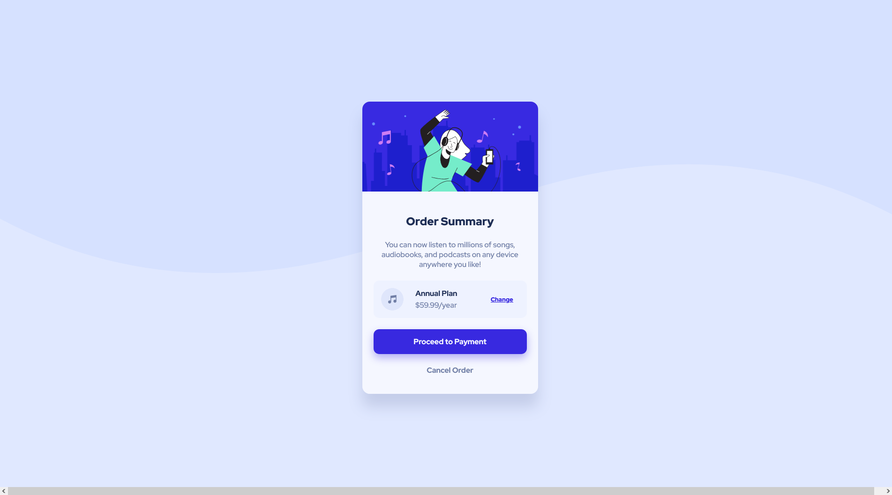

# Frontend Mentor - Order summary card solution

This is a solution to the [Order summary card challenge on Frontend Mentor](https://www.frontendmentor.io/challenges/order-summary-component-QlPmajDUj). Frontend Mentor challenges help you improve your coding skills by building realistic projects.

## Table of contents

- [Overview](#overview)
  - [The challenge](#the-challenge)
  - [Screenshot](#screenshot)
  - [Links](#links)
- [My process](#my-process)
  - [Built with](#built-with)
  - [What I learned](#what-i-learned)
  - [Continued development](#continued-development)
- [Author](#author)
- [Acknowledgments](#acknowledgments)

## Overview

### The challenge

Users should be able to:

- See hover states for interactive elements

### Screenshot

### Links

- Solution URL: [https://github.com/devshot-dotcom/order-summary-component](https://github.com/devshot-dotcom/order-summary-component)
- Live Site URL: [Add live site URL here](https://your-live-site-url.com)

## My process

### Built with

- Semantic HTML5 markup
- CSS custom properties
- Flexbox (Once or twice)
- CSS Grid (Just for centering)
- Mobile-first workflow
- Pure HTML & CSS

### What we learned

CSS is just like one of those fairytales that you keep on stumbling upon and discover new magical points of view everytime. After quite some years of working with CSS, it's always refreshing to have these interesting and colorful projects. Today, at the 2nd of September, 2021, we gave our developers a little relaxation through this challenge and guess what, it turned out to be quite a lovely day.

The component itself looks quite simple and yet it is quite easy to design, what makes it challenging are the little details that most developers, straightway, don't care about. This response becomes even harsh in the practical field as we saw today, 8 out of 10 developers didn't come up with the minor shadow beneath the button and 6 of them did this intentionally as they found it _useless_.

While almost all of them were able to successfully complete the component in less than 2 hours, some results were simply not at that level. Sometimes the HTML markup felt it it's coming from HTML4, sometimes the CSS felt unnecessary and repititive, and sometimes the colors just didn't feel right, but all in all, it was a fun and creative experience.

### Continued development

CSS Grid is our number one priority because it delivers the most performant and concise code as well as packs a big punch. We've tried gaining a lead on it beforehand but simultaneous projects were always a hinderance. Other than this, accessibility in HTML is a big concern.

## Author

- Website - [https://devshot-dotcom.github.io](https://devshot-dotcom.github.io)
- Frontend Mentor - [@devshot-dotcom](https://www.frontendmentor.io/profile/devshot-dotcom)

**Note: Delete this note and add/remove/edit lines above based on what links you'd like to share.**

## Acknowledgments

Lots of love to the great team at [Devshot-Dotcom](https://devshot-dotcom.github.io) and tons of gratitude for the amazing team at [Frontend Mentor](https://www.frontendmentor.io/) for this cool and creative challenge.
